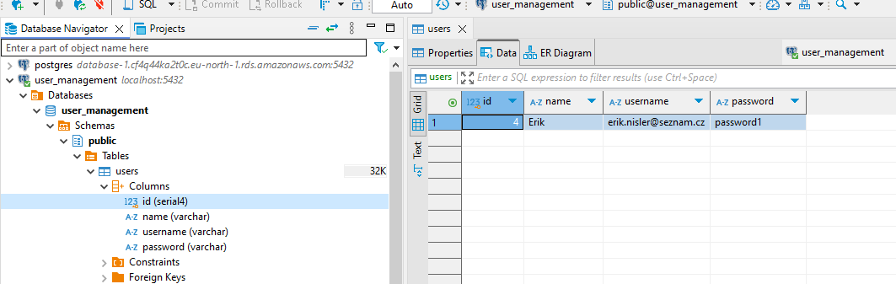

**User management**

Easy command line like user management application for Moro-systems as a homework.

This Spring boot application is running on Java 21 extended with CommandLineRunner
simulating real login app.

Unfortunately, database for now is running only on my localhost, in near future
database on cloud will be implemented.

**Key phases**

**Phase 1 - Database creation**

Auto-increment for ID implemented

**Phase 2 - Data**

Adding basic CRUD operation for spring boot request-mapping.

**Phase 3 - User login**

Implementation of command-line runner for login simulation.

Added username and password into DB.

User can modify its own password - update query in UserRepository.

***Spring security - critical point from my side - lack of knowledge in this part of
homework - only partly implemented***

**Phase 4 - Possible update**

It would be nice to add roles with spring-security for users.

Better front end - react?

